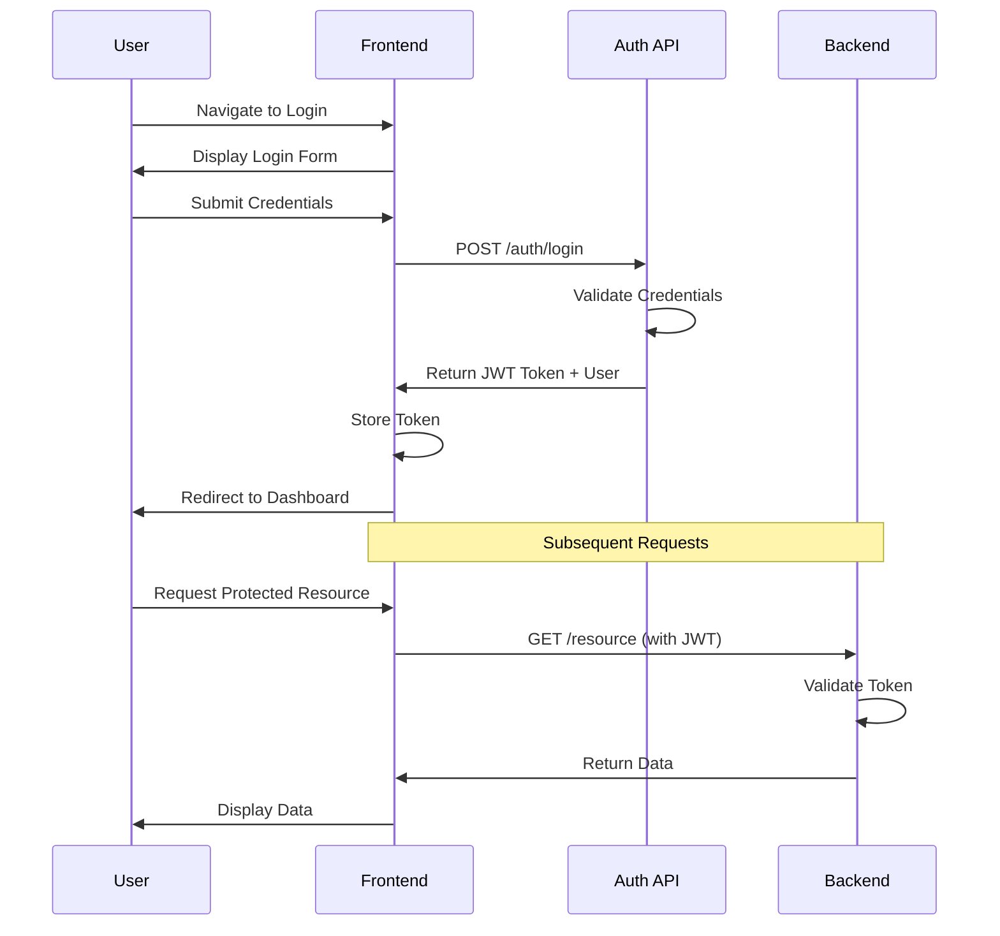
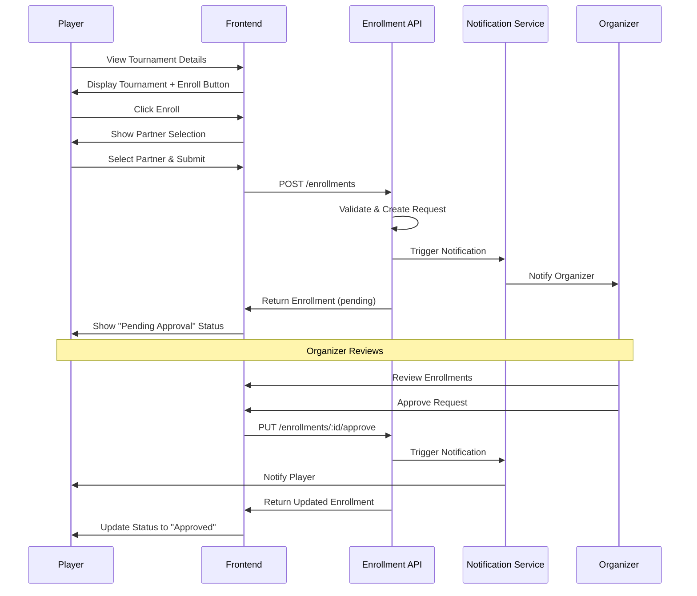
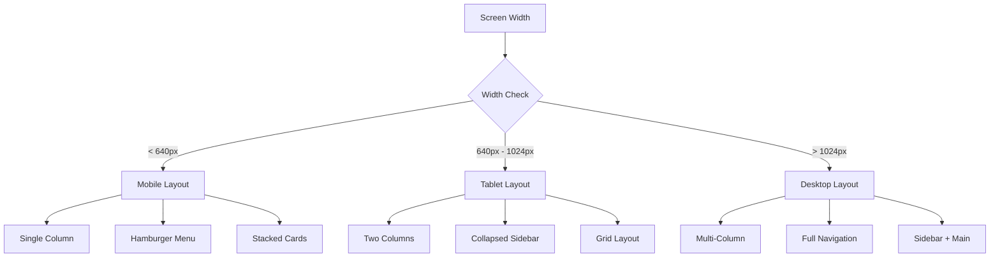
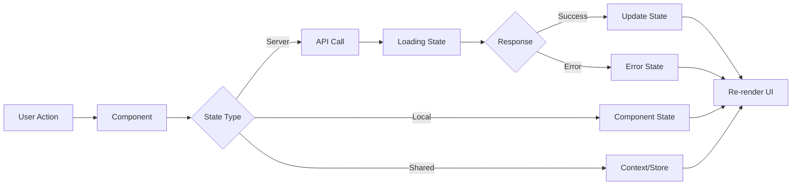

# Feature Specification: Frontend Web Responsive - Padel Tournament Management System

**Created**: December 26, 2025

## User Scenarios & Testing *(mandatory)*

<!--
  IMPORTANT: User stories should be PRIORITIZED as user journeys ordered by importance.
  Each user story/journey must be INDEPENDENTLY TESTABLE - meaning if you implement just ONE of them,
  you should still have a viable MVP (Minimum Viable Product) that delivers value.
  
  Assign priorities (P1, P2, P3, etc.) to each story, where P1 is the most critical.
  Think of each story as a standalone slice of functionality that can be:
  - Developed independently
  - Tested independently
  - Deployed independently
  - Demonstrated to users independently
-->

### User Story 1 - Authentication and User Onboarding (Priority: P1)

As a new user, I want to register, log in, and set up my player profile so that I can access the platform and participate in tournaments.

**Why this priority**: Without authentication and basic profile setup, users cannot access any functionality. This is the entry point to the entire application.

**Independent Test**: Can be fully tested by registering a new user, logging in, completing the player profile setup, and verifying the user can access their dashboard. Delivers immediate value by allowing users to create accounts and access the platform.

**Acceptance Scenarios**:

1. **Scenario**: Register a new account
   - **Given** I am on the landing page
   - **When** I click "Register" and fill in email, password, full name, and phone number
   - **Then** My account is created and I receive a success message

2. **Scenario**: Log in to existing account
   - **Given** I have a registered account
   - **When** I enter my email and password on the login page
   - **Then** I am redirected to my dashboard with a valid session

3. **Scenario**: Complete player profile
   - **Given** I am logged in for the first time
   - **When** I complete my player profile with playing hand, skill level, and profile picture
   - **Then** My profile is saved and I can view it on my dashboard

4. **Scenario**: Register as player in an association
   - **Given** I have a basic account
   - **When** I select an association and request to join as a player
   - **Then** My request is submitted and I receive confirmation

5. **Scenario**: Responsive login on mobile
   - **Given** I am accessing the site on a mobile device
   - **When** I navigate to the login page
   - **Then** The form is properly sized and usable on my device screen

---

### User Story 2 - Browse and View Tournaments (Priority: P1)

As a player, I want to browse available tournaments, filter by category and status, and view detailed tournament information so that I can find tournaments that match my skill level and schedule.

**Why this priority**: Core discovery functionality that allows users to find and explore tournaments. Essential for engagement and tournament participation.

**Independent Test**: Can be fully tested by browsing the tournament list, applying filters, and viewing tournament details. Delivers value by helping users discover relevant tournaments.

**Acceptance Scenarios**:

1. **Scenario**: View all tournaments
   - **Given** I am on the tournaments page
   - **When** The page loads
   - **Then** I see a paginated list of all tournaments with name, date, location, and status

2. **Scenario**: Filter tournaments by status
   - **Given** I am viewing the tournaments list
   - **When** I select "Upcoming" from the status filter
   - **Then** Only upcoming tournaments are displayed

3. **Scenario**: Filter tournaments by category
   - **Given** I am viewing the tournaments list
   - **When** I select "3rd Category" from the category filter
   - **Then** Only tournaments for 3rd category are displayed

4. **Scenario**: View tournament details
   - **Given** I am viewing the tournaments list
   - **When** I click on a tournament card
   - **Then** I see full tournament details including format, dates, location, enrolled teams, and point distribution

5. **Scenario**: Responsive tournament cards on mobile
   - **Given** I am browsing tournaments on a mobile device
   - **When** I scroll through the list
   - **Then** Tournament cards are properly formatted and readable on my screen

6. **Scenario**: Search tournaments by name
   - **Given** I am on the tournaments page
   - **When** I type "Summer" in the search box
   - **Then** Only tournaments with "Summer" in their name are displayed

---

### User Story 3 - Tournament Enrollment (Priority: P1)

As a player, I want to enroll in tournaments with a partner and track my enrollment status so that I can participate in competitions.

**Why this priority**: Core functionality for tournament participation. Without enrollment, players cannot compete.

**Independent Test**: Can be fully tested by selecting a tournament, choosing a partner, submitting enrollment, and viewing enrollment status. Delivers value by enabling tournament participation.

**Acceptance Scenarios**:

1. **Scenario**: Enroll in a tournament with a partner
   - **Given** I am viewing a tournament detail page
   - **When** I click "Enroll", select a partner from my frequent partners list, and submit
   - **Then** My enrollment request is submitted and I see a "Pending Approval" status

2. **Scenario**: Search for a new partner
   - **Given** I am enrolling in a tournament
   - **When** I search for a partner by name or email
   - **Then** I see matching players and can select one as my partner

3. **Scenario**: View my enrollments
   - **Given** I am on my dashboard
   - **When** I navigate to "My Enrollments" section
   - **Then** I see all my tournament enrollments with their current status (pending, approved, rejected)

4. **Scenario**: Receive enrollment approval notification
   - **Given** I have a pending enrollment
   - **When** The organizer approves my enrollment
   - **Then** I receive a notification and my enrollment status updates to "Approved"

5. **Scenario**: Cannot enroll in full tournament
   - **Given** I am viewing a tournament that has reached capacity
   - **When** I try to enroll
   - **Then** The enroll button is disabled and I see "Tournament Full" message

---

### User Story 4 - View Rankings and Statistics (Priority: P2)

As a player, I want to view category-specific rankings, my personal statistics, and tournament history so that I can track my performance and progress.

**Why this priority**: Important for player engagement and competitive motivation, but not essential for basic tournament participation.

**Independent Test**: Can be fully tested by viewing rankings, filtering by category, and viewing personal statistics. Delivers value by providing performance insights.

**Acceptance Scenarios**:

1. **Scenario**: View category rankings
   - **Given** I am on the rankings page
   - **When** I select "3rd Category" from the category filter
   - **Then** I see a ranked list of players in that category with their points and position

2. **Scenario**: View my personal statistics
   - **Given** I am on my profile page
   - **When** I navigate to the "Statistics" tab
   - **Then** I see my win/loss record, total points, tournaments played, and win rate

3. **Scenario**: View tournament statistics
   - **Given** I am viewing tournament statistics
   - **When** The page loads
   - **Then** I see total tournaments, matches played, completion rate, and average metrics

4. **Scenario**: View my ranking position
   - **Given** I am viewing my profile
   - **When** I check my category rankings
   - **Then** I see my current position in each category I participate in

5. **Scenario**: Responsive statistics on mobile
   - **Given** I am viewing statistics on a mobile device
   - **When** I scroll through the data
   - **Then** Charts and tables are properly formatted for mobile viewing

---

### User Story 5 - Tournament Management (Organizer) (Priority: P2)

As a tournament organizer, I want to create tournaments, manage enrollments, and update tournament progress so that I can run competitions effectively.

**Why this priority**: Essential for organizers but secondary to player-facing features. Organizers are a smaller user group.

**Independent Test**: Can be fully tested by creating a tournament, reviewing enrollments, and updating tournament status. Delivers value by enabling tournament organization.

**Acceptance Scenarios**:

1. **Scenario**: Create a new tournament
   - **Given** I am logged in as an organizer
   - **When** I fill in the tournament creation form with name, dates, format, categories, and point distribution
   - **Then** The tournament is created and visible in the tournaments list

2. **Scenario**: Review enrollment requests
   - **Given** I am viewing my tournament's enrollments
   - **When** I see pending enrollment requests
   - **Then** I can approve or reject each request with an optional message

3. **Scenario**: Update tournament status
   - **Given** I am managing a tournament
   - **When** I change the status from "Upcoming" to "In Progress"
   - **Then** The tournament status is updated and participants are notified

4. **Scenario**: View tournament participants
   - **Given** I am viewing my tournament details
   - **When** I navigate to the "Participants" tab
   - **Then** I see all enrolled teams with player names and categories

5. **Scenario**: Edit tournament details
   - **Given** I am viewing my tournament
   - **When** I click "Edit" and modify tournament settings
   - **Then** The changes are saved and reflected in the tournament details

---

### User Story 6 - Notifications and Real-time Updates (Priority: P3)

As a user, I want to receive notifications about enrollment status, tournament updates, and match schedules so that I stay informed about important events.

**Why this priority**: Enhances user experience but not critical for core functionality. Can be added after basic features are working.

**Independent Test**: Can be fully tested by triggering various events and verifying notifications appear. Delivers value by keeping users informed.

**Acceptance Scenarios**:

1. **Scenario**: Receive enrollment approval notification
   - **Given** I have a pending enrollment
   - **When** The organizer approves it
   - **Then** I see a notification badge and can view the notification details

2. **Scenario**: View all notifications
   - **Given** I am logged in
   - **When** I click the notifications icon
   - **Then** I see a list of all my notifications with timestamps

3. **Scenario**: Mark notifications as read
   - **Given** I have unread notifications
   - **When** I view a notification
   - **Then** It is marked as read and the unread count decreases

4. **Scenario**: Receive tournament update notification
   - **Given** I am enrolled in a tournament
   - **When** The organizer updates the tournament status or details
   - **Then** I receive a notification about the update

---

### User Story 7 - Association Management (Priority: P3)

As a player, I want to view associations, request membership, and manage my categories in different associations so that I can participate in multiple organizations.

**Why this priority**: Important for multi-association support but can be implemented after core features.

**Independent Test**: Can be fully tested by browsing associations, requesting membership, and viewing association-specific information. Delivers value by enabling multi-association participation.

**Acceptance Scenarios**:

1. **Scenario**: Browse associations
   - **Given** I am on the associations page
   - **When** The page loads
   - **Then** I see a list of all associations with their names, locations, and member counts

2. **Scenario**: Request association membership
   - **Given** I am viewing an association I'm not a member of
   - **When** I click "Request to Join"
   - **Then** My membership request is submitted and I see a "Pending" status

3. **Scenario**: View my association memberships
   - **Given** I am on my profile page
   - **When** I navigate to "My Associations"
   - **Then** I see all associations I belong to with my category in each

4. **Scenario**: Update category in an association
   - **Given** I am a member of an association
   - **When** I update my category for that association
   - **Then** My category is updated and reflected in my profile

---

### Edge Cases

- What happens when a user tries to enroll in a tournament while already having a pending enrollment?
- How does the system handle network failures during enrollment submission?
- What occurs when a tournament is deleted while a user is viewing its details?
- How are concurrent enrollment requests handled when a tournament has only one spot remaining?
- What happens when a user's session expires while filling out a form?
- How does the UI handle very long tournament names or descriptions?
- What occurs when a user tries to access a page they don't have permissions for?
- How does the system handle image uploads that exceed size limits?
- What happens when API requests fail or timeout?
- How are date/time zones handled for tournaments in different locations?
- What occurs when a user has no notifications to display?
- How does pagination work when the total count changes during browsing?

## Requirements *(mandatory)*

### Functional Requirements

#### Authentication & User Management
- **FR-001**: System MUST provide user registration with email, password, full name, and phone number
- **FR-002**: System MUST provide secure login with email and password
- **FR-003**: System MUST maintain user sessions using JWT tokens
- **FR-004**: System MUST allow users to view and update their player profiles
- **FR-005**: System MUST support profile picture upload and display
- **FR-006**: System MUST allow users to register as players in associations

#### Tournament Discovery & Viewing
- **FR-007**: System MUST display a paginated list of all tournaments
- **FR-008**: System MUST allow filtering tournaments by status (upcoming, in_progress, completed, cancelled)
- **FR-009**: System MUST allow filtering tournaments by category (1st to 8th)
- **FR-010**: System MUST provide search functionality for tournaments by name
- **FR-011**: System MUST display tournament details including format, dates, location, enrolled teams, and point distribution
- **FR-012**: System MUST show tournament capacity and available spots when configured as visible

#### Tournament Enrollment
- **FR-013**: System MUST allow players to enroll in tournaments with a partner
- **FR-014**: System MUST support partner selection from frequent partners list
- **FR-015**: System MUST support searching for new partners by name or email
- **FR-016**: System MUST display enrollment status (pending, approved, rejected)
- **FR-017**: System MUST prevent enrollment in full tournaments
- **FR-018**: System MUST allow users to view all their tournament enrollments

#### Rankings & Statistics
- **FR-019**: System MUST display category-specific player rankings with positions and points
- **FR-020**: System MUST show player personal statistics including wins, losses, win rate, and total points
- **FR-021**: System MUST display tournament statistics including total tournaments, matches, and completion rates
- **FR-022**: System MUST show player's ranking position in each category they participate in
- **FR-023**: System MUST support pagination for rankings lists

#### Tournament Management (Organizer)
- **FR-024**: System MUST allow organizers to create tournaments with configurable settings
- **FR-025**: System MUST allow organizers to review and approve/reject enrollment requests
- **FR-026**: System MUST allow organizers to update tournament status
- **FR-027**: System MUST allow organizers to view all tournament participants
- **FR-028**: System MUST allow organizers to edit tournament details
- **FR-029**: System MUST validate tournament data before creation/update

#### Notifications
- **FR-030**: System MUST display notifications for enrollment status changes
- **FR-031**: System MUST display notifications for tournament updates
- **FR-032**: System MUST show unread notification count
- **FR-033**: System MUST allow users to mark notifications as read
- **FR-034**: System MUST display notification timestamps

#### Association Management
- **FR-035**: System MUST display a list of all associations
- **FR-036**: System MUST allow players to request association membership
- **FR-037**: System MUST display user's association memberships with categories
- **FR-038**: System MUST allow users to update their category in each association

#### Responsive Design
- **FR-039**: System MUST be fully responsive and usable on mobile devices (320px width minimum)
- **FR-040**: System MUST be fully responsive and usable on tablet devices (768px width minimum)
- **FR-041**: System MUST be fully responsive and usable on desktop devices (1024px width minimum)
- **FR-042**: System MUST provide touch-friendly UI elements on mobile devices
- **FR-043**: System MUST adapt navigation for different screen sizes

#### Error Handling & UX
- **FR-044**: System MUST display user-friendly error messages for failed operations
- **FR-045**: System MUST show loading states during API requests
- **FR-046**: System MUST handle network failures gracefully with retry options
- **FR-047**: System MUST validate form inputs before submission
- **FR-048**: System MUST prevent duplicate form submissions
- **FR-049**: System MUST handle session expiration with redirect to login

### Non-Functional Requirements

#### Performance
- **NFR-001**: Initial page load MUST complete within 3 seconds on 3G connection
- **NFR-002**: API requests MUST show loading indicators after 200ms
- **NFR-003**: Images MUST be optimized and lazy-loaded
- **NFR-004**: List pagination MUST load new pages within 1 second

#### Security
- **NFR-005**: All API requests MUST include authentication tokens
- **NFR-006**: Sensitive data MUST NOT be stored in localStorage (use httpOnly cookies for tokens)
- **NFR-007**: Forms MUST validate input to prevent XSS attacks
- **NFR-008**: File uploads MUST validate file types and sizes

#### Accessibility
- **NFR-009**: Application MUST meet WCAG 2.1 Level AA standards
- **NFR-010**: All interactive elements MUST be keyboard accessible
- **NFR-011**: All images MUST have alt text
- **NFR-012**: Color contrast MUST meet accessibility standards

#### Browser Support
- **NFR-013**: Application MUST support latest 2 versions of Chrome, Firefox, Safari, and Edge
- **NFR-014**: Application MUST support iOS Safari (latest 2 versions)
- **NFR-015**: Application MUST support Android Chrome (latest 2 versions)

### Key Entities

- **User**: Represents an authenticated user with email, password, full name, phone number, and role
  - Can be a player, organizer, or both
  - Has a player profile with additional information
  - Can belong to multiple associations

- **Player Profile**: Extended user information including playing hand, skill level, profile picture, and statistics
  - Linked to a user account
  - Contains association memberships with categories

- **Tournament**: Represents a padel competition with name, dates, location, format, categories, and settings
  - Belongs to an association
  - Has enrollment requests and enrolled teams
  - Has configurable point distribution

- **Enrollment Request**: Represents a player's request to participate in a tournament with a partner
  - Has status (pending, approved, rejected)
  - Links two players as a team
  - Requires organizer approval

- **Association**: Represents a padel organization
  - Has tournaments and members
  - Maintains category system and rankings

- **Ranking Entry**: Represents a player's position in a category ranking
  - Shows position, points, and tournament count
  - Specific to a category and season

- **Notification**: Represents a system notification for a user
  - Has type, message, timestamp, and read status
  - Linked to specific events (enrollment, tournament updates)

- **Statistics**: Aggregated data about tournaments, players, and categories
  - Tournament statistics (total tournaments, matches, completion rate)
  - Player statistics (wins, losses, win rate, points)
  - Category statistics (players per category, top players)

## Success Criteria *(mandatory)*

### Measurable Outcomes

#### User Engagement
- **SC-001**: 90% of new users successfully complete registration and profile setup within 5 minutes
- **SC-002**: Users can find and view tournament details within 3 clicks from the homepage
- **SC-003**: 80% of tournament enrollments are completed without errors on first attempt
- **SC-004**: Users spend average of 5+ minutes per session browsing tournaments and rankings

#### Performance
- **SC-005**: 95% of page loads complete within 3 seconds on 3G connection
- **SC-006**: API requests complete within 1 second for 90% of requests
- **SC-007**: Zero critical errors in browser console during normal usage

#### Usability
- **SC-008**: Mobile users can complete all core tasks (browse, enroll, view rankings) without horizontal scrolling
- **SC-009**: 95% of form submissions succeed on first attempt (excluding validation errors)
- **SC-010**: Users can access any page within the application in 4 clicks or less

#### Accessibility
- **SC-011**: Application passes automated accessibility testing (WAVE, axe) with zero critical errors
- **SC-012**: All interactive elements are keyboard accessible and have visible focus states
- **SC-013**: Application maintains 4.5:1 color contrast ratio for all text

#### Organizer Efficiency
- **SC-014**: Organizers can create a new tournament in under 5 minutes
- **SC-015**: Organizers can review and process 10 enrollment requests in under 2 minutes
- **SC-016**: Tournament status updates reflect in the UI within 2 seconds

### Mermaid Diagrams *(include if feature involves complex interactions)*

#### User Authentication Flow

#### Tournament Enrollment Flow

#### Responsive Layout Breakpoints

#### State Management Flow

## Technical Stack Recommendations

### Frontend Framework
- **React 18+** with TypeScript for type safety and modern features
- **Next.js 14+** for SSR, routing, and optimized builds (optional but recommended)
- **Vite** as alternative build tool for faster development

### UI Framework & Styling
- **TailwindCSS** for utility-first styling and responsive design
- **shadcn/ui** for accessible, customizable component library
- **Lucide React** for consistent iconography
- **Framer Motion** for smooth animations and transitions

### State Management
- **React Query (TanStack Query)** for server state management and caching
- **Zustand** or **Context API** for client state management
- **React Hook Form** for form state and validation

### API Integration
- **Axios** or **Fetch API** for HTTP requests
- **OpenAPI/Swagger** client generation for type-safe API calls

### Routing
- **React Router v6** for client-side routing
- **Next.js App Router** if using Next.js

### Form Validation
- **Zod** for schema validation
- **React Hook Form** for form handling

### Date/Time Handling
- **date-fns** or **Day.js** for date manipulation and formatting

### Image Handling
- **React Dropzone** for file uploads
- **Next.js Image** component for optimized images

### Testing
- **Vitest** for unit testing
- **React Testing Library** for component testing
- **Playwright** or **Cypress** for E2E testing

### Code Quality
- **ESLint** for linting
- **Prettier** for code formatting
- **TypeScript** for type checking

## API Endpoints Reference

### Authentication
- `POST /auth/register` - Register new user
- `POST /auth/login` - User login
- `GET /auth/profile` - Get current user profile

### Users
- `GET /users/me/player-profile` - Get current player profile
- `PUT /users/me/player-profile` - Update player profile
- `POST /users/me/player-registration` - Register as player in association
- `PUT /users/me/associations/:associationId/category` - Update category

### Tournaments
- `GET /tournaments` - List tournaments (with pagination and filters)
- `GET /tournaments/:id` - Get tournament details
- `POST /tournaments` - Create tournament (organizer)
- `PUT /tournaments/:id` - Update tournament (organizer)
- `DELETE /tournaments/:id` - Delete tournament (organizer)
- `PUT /tournaments/:id/status` - Update tournament status (organizer)

### Enrollments
- `POST /tournaments/:tournamentId/enrollments` - Submit enrollment request
- `GET /tournaments/:tournamentId/enrollments` - List tournament enrollments
- `PUT /enrollments/:id/approve` - Approve enrollment (organizer)
- `PUT /enrollments/:id/reject` - Reject enrollment (organizer)
- `GET /users/me/enrollments` - Get my enrollments

### Rankings
- `GET /associations/:associationId/rankings` - Get category rankings
- `GET /associations/:associationId/statistics/tournaments` - Get tournament statistics
- `GET /associations/:associationId/statistics/players/:userId` - Get player statistics
- `GET /associations/:associationId/statistics/categories` - Get category statistics

### Associations
- `GET /associations` - List all associations
- `GET /associations/:id` - Get association details
- `POST /associations/:id/membership-requests` - Request membership

### Notifications
- `GET /notifications` - Get user notifications
- `PUT /notifications/:id/read` - Mark notification as read
- `PUT /notifications/read-all` - Mark all as read

## UI/UX Guidelines

### Design Principles
1. **Mobile-First**: Design for mobile screens first, then scale up
2. **Accessibility**: Ensure all users can access and use the application
3. **Performance**: Optimize for fast loading and smooth interactions
4. **Consistency**: Use consistent patterns, colors, and spacing throughout
5. **Feedback**: Provide clear feedback for all user actions

### Color Palette Recommendations
- **Primary**: Padel green (#00A86B or similar)
- **Secondary**: Dark blue or navy (#1E3A8A)
- **Success**: Green (#10B981)
- **Warning**: Yellow/Orange (#F59E0B)
- **Error**: Red (#EF4444)
- **Neutral**: Gray scale (#F9FAFB to #111827)

### Typography
- **Headings**: Bold, clear hierarchy (H1: 2.5rem, H2: 2rem, H3: 1.5rem)
- **Body**: Readable size (16px minimum on mobile)
- **Font Family**: Modern sans-serif (Inter, Roboto, or system fonts)

### Spacing
- Use consistent spacing scale (4px, 8px, 16px, 24px, 32px, 48px, 64px)
- Maintain adequate white space for readability
- Use padding and margins consistently

### Components
- **Buttons**: Clear, touch-friendly (minimum 44px height on mobile)
- **Forms**: Clear labels, inline validation, helpful error messages
- **Cards**: Consistent shadow, border-radius, and padding
- **Navigation**: Sticky header on mobile, sidebar on desktop
- **Modals**: Centered, with backdrop, keyboard accessible

### Responsive Breakpoints
- **Mobile**: 320px - 639px
- **Tablet**: 640px - 1023px
- **Desktop**: 1024px - 1279px
- **Large Desktop**: 1280px+

## Page Structure

### Public Pages
1. **Landing Page** - Hero, features, CTA to register/login
2. **Login Page** - Email/password form
3. **Register Page** - User registration form
4. **Tournaments Browse** - Public tournament list (limited info)

### Authenticated Pages
1. **Dashboard** - Overview of enrollments, upcoming tournaments, notifications
2. **Tournaments List** - Full tournament list with filters and search
3. **Tournament Details** - Complete tournament information and enrollment
4. **My Profile** - Player profile, statistics, association memberships
5. **Rankings** - Category-specific rankings with filters
6. **My Enrollments** - List of all user enrollments with status
7. **Notifications** - All user notifications

### Organizer Pages
1. **Create Tournament** - Tournament creation form
2. **Manage Tournament** - Edit tournament, review enrollments, update status
3. **Enrollments Review** - List of pending enrollment requests

### Association Pages
1. **Associations List** - Browse all associations
2. **Association Details** - Association info, tournaments, members

## Implementation Notes

### Authentication Flow
1. Store JWT token in httpOnly cookie (preferred) or secure localStorage
2. Include token in Authorization header for all API requests
3. Implement token refresh mechanism
4. Redirect to login on 401 responses
5. Clear token on logout

### Error Handling
1. Display user-friendly error messages
2. Log errors to console for debugging
3. Provide retry options for failed requests
4. Show fallback UI for critical errors
5. Handle network offline state

### Loading States
1. Show skeleton loaders for content
2. Display spinners for actions (buttons, forms)
3. Use optimistic updates where appropriate
4. Disable buttons during submission
5. Show progress for multi-step processes

### Form Validation
1. Validate on blur for better UX
2. Show inline error messages
3. Disable submit until form is valid
4. Prevent duplicate submissions
5. Preserve form data on errors

### Image Optimization
1. Compress images before upload
2. Use WebP format with fallbacks
3. Implement lazy loading
4. Use responsive images (srcset)
5. Show placeholders while loading

### SEO Considerations (if using SSR)
1. Set proper meta tags for each page
2. Use semantic HTML
3. Implement Open Graph tags
4. Add structured data where relevant
5. Ensure proper heading hierarchy

## Accessibility Checklist

- [ ] All images have alt text
- [ ] All interactive elements are keyboard accessible
- [ ] Focus states are visible
- [ ] Color contrast meets WCAG AA standards
- [ ] Forms have proper labels and error messages
- [ ] ARIA labels used where appropriate
- [ ] Skip navigation link provided
- [ ] Headings follow proper hierarchy
- [ ] Tables have proper headers
- [ ] Modals trap focus and can be closed with Escape

## Testing Strategy

### Unit Tests
- Test utility functions
- Test form validation logic
- Test state management logic
- Test API client functions

### Component Tests
- Test component rendering
- Test user interactions
- Test conditional rendering
- Test prop handling

### Integration Tests
- Test page flows
- Test API integration
- Test authentication flow
- Test form submissions

### E2E Tests
- Test complete user journeys
- Test critical paths (register, login, enroll)
- Test responsive behavior
- Test error scenarios

## Deployment Considerations

### Environment Variables
- API base URL
- Authentication configuration
- Feature flags
- Analytics keys

### Build Optimization
- Code splitting
- Tree shaking
- Minification
- Compression (gzip/brotli)

### Hosting Options
- **Vercel** (recommended for Next.js)
- **Netlify** (good for static sites)
- **AWS Amplify**
- **Firebase Hosting**

### CI/CD
- Automated testing on PR
- Automated builds on merge
- Preview deployments for PRs
- Production deployment on main branch

## Future Enhancements

### Phase 2 Features
- Real-time match updates with WebSockets
- Live tournament brackets visualization
- Social media integration for sharing
- Advanced statistics and analytics
- Player comparison tools
- Tournament calendar view
- Email notifications
- Push notifications (PWA)

### Phase 3 Features
- Mobile app (React Native)
- Offline support (PWA)
- Multi-language support (i18n)
- Dark mode
- Advanced search with filters
- Player messaging system
- Tournament live streaming integration
- Payment integration for tournament fees
